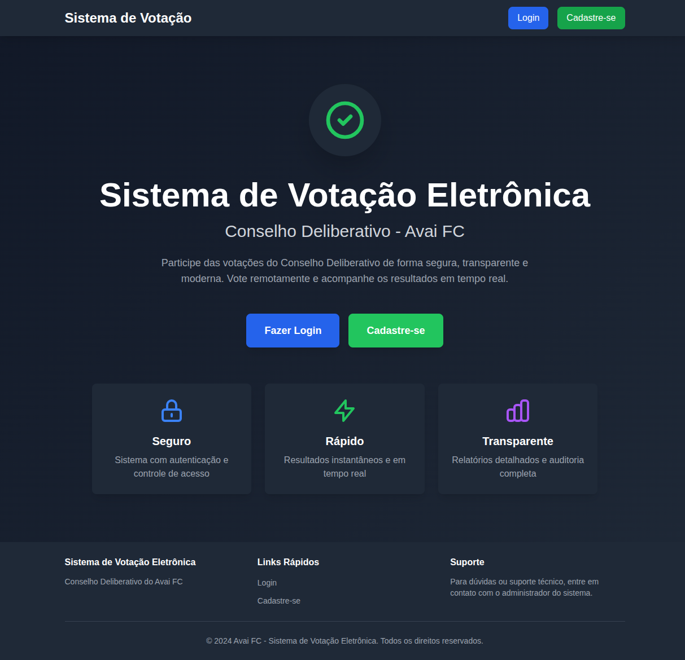
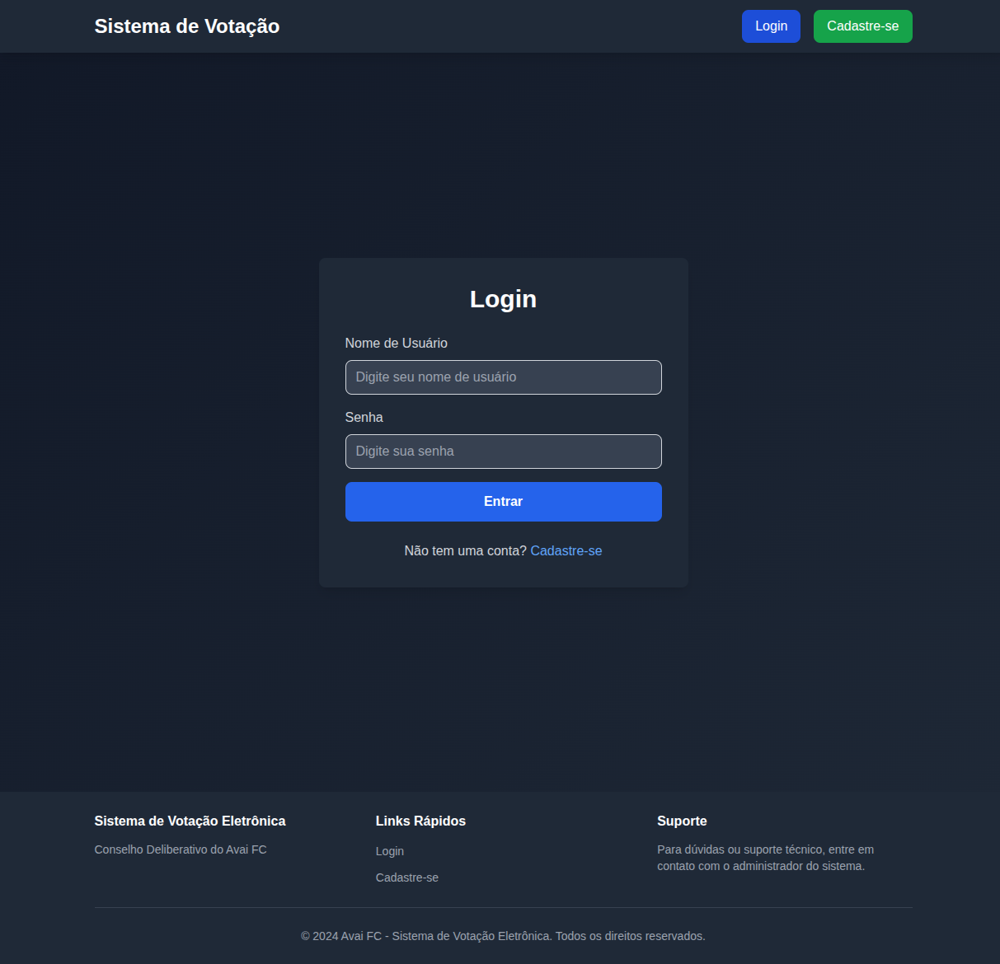
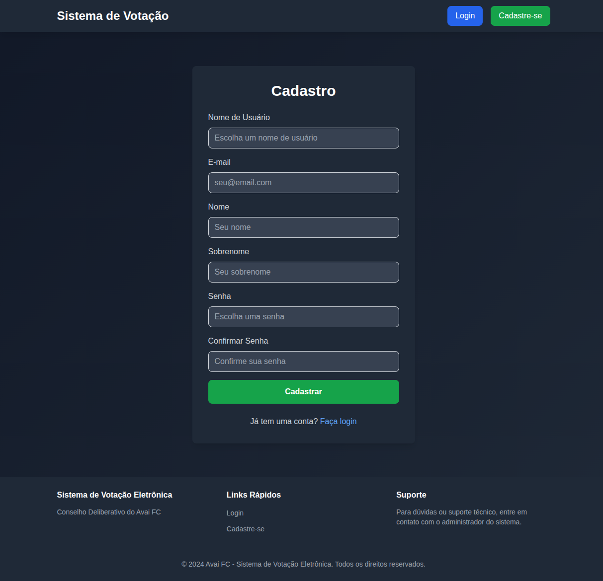
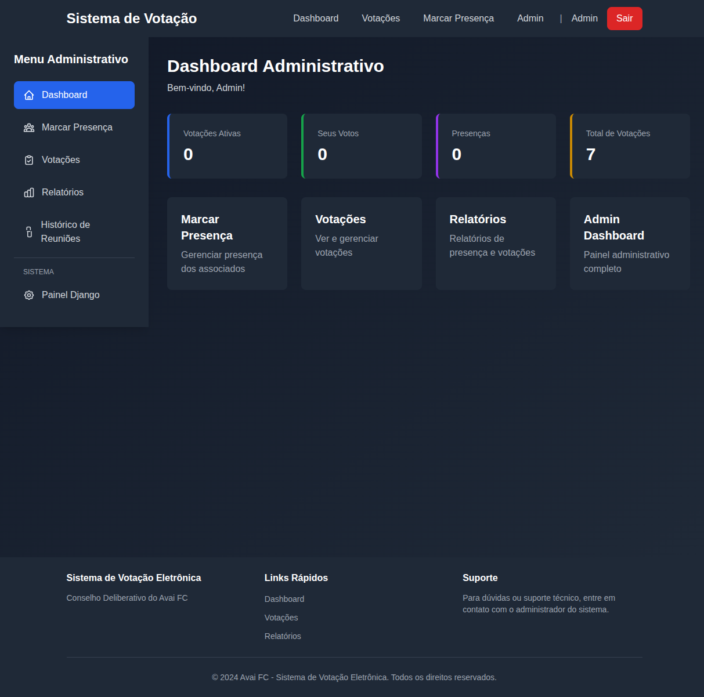
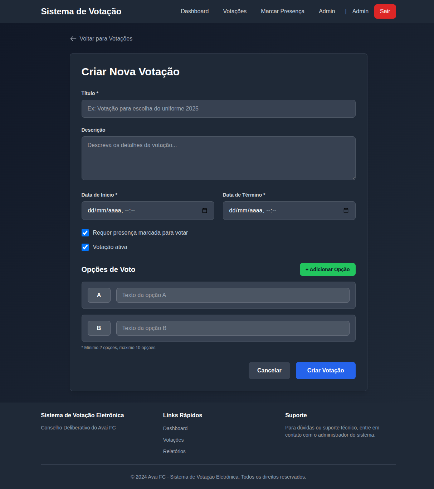
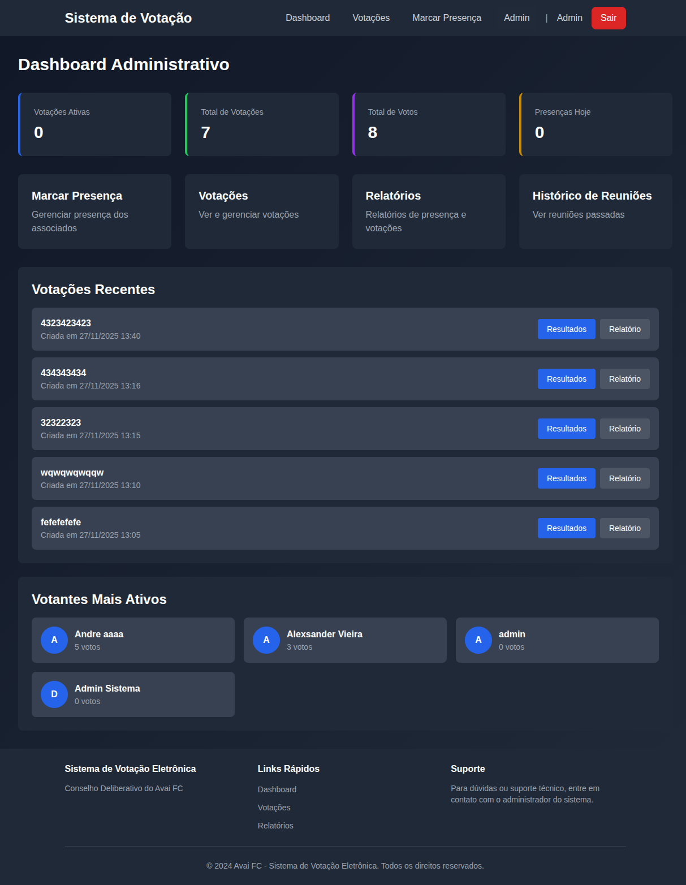
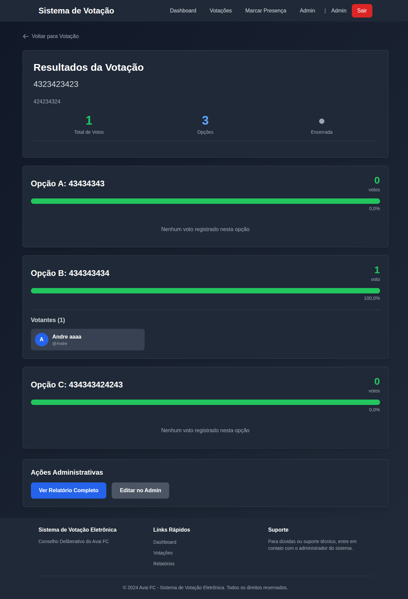

# 📊 Sistema de Votação Eletrônica - Avaí FC

### 🎯 Visão Geral

O **Sistema de Votação Eletrônica do Avaí FC** é uma solução completa e moderna para gerenciar votações e presenças do Conselho Deliberativo. Desenvolvido com tecnologias robustas e interface intuitiva, o sistema garante segurança, transparência e eficiência nas decisões do clube.

---

## ✨ Principais Benefícios

### Para o Conselho Deliberativo

- ✅ **Votações Remotas**: Membros podem votar de qualquer lugar
- ✅ **Resultados em Tempo Real**: Acompanhamento instantâneo da votação
- ✅ **Controle de Presença**: Sistema integrado de chamada e registro
- ✅ **Transparência Total**: Relatórios detalhados de todas as votações
- ✅ **Segurança**: Um voto por pessoa, autenticação obrigatória

### Para Administradores

- 📊 **Dashboard Completo**: Visão geral de estatísticas e métricas
- 🎯 **Gestão Simplificada**: Interface administrativa intuitiva
- 📈 **Relatórios Detalhados**: Análises completas de participação e resultados
- ⚡ **Rápido e Eficiente**: Criação de votações em poucos cliques

---

## 🖥️ Demonstração Visual do Sistema

### 1. Página Inicial - Design Moderno e Profissional



**Destaques:**
- Design responsivo com cores do Avaí FC
- Tema escuro moderno e elegante
- Acesso fácil ao login e cadastro
- Apresentação clara dos benefícios: Seguro, Rápido e Transparente

---

### 2. Login - Segurança e Simplicidade



**Características:**
- Sistema de autenticação robusto
- Interface limpa e intuitiva
- Validação de credenciais
- Link direto para cadastro de novos usuários

---

### 3. Cadastro - Processo Rápido e Completo



**Funcionalidades:**
- Formulário completo com validação
- Campos para nome completo e email
- Confirmação de senha para segurança
- Processo em uma única página

---

### 4. Dashboard Administrativo - Controle Total



**Recursos:**
- Menu lateral com acesso rápido a todas as funcionalidades
- Cards com estatísticas importantes (votações ativas, total de votos, presenças)
- Atalhos para principais operações
- Design clean e organizado

---

### 5. Gestão de Presença - Controle em Tempo Real


**Funcionalidades:**
- Lista completa de todos os associados
- Botões de marcar/desmarcar presença com um clique
- Busca rápida por nome, username ou email
- Estatísticas de presença em tempo real
- Taxa de presença calculada automaticamente
- Sistema de avatar com iniciais

**Caso de Uso:**
> Durante uma reunião, o secretário pode facilmente marcar a presença de todos os membros presentes, garantindo que apenas quem está na reunião possa votar.

---

### 6. Criação de Votação - Simples e Poderoso



**Recursos:**
- Título e descrição personalizáveis
- Datas de início e término configuráveis
- Opções de votação dinâmicas (A, B, C, D...)
- Configuração se requer presença para votar
- Interface intuitiva para adicionar/remover opções
- Mínimo de 2 opções, máximo de 10

**Exemplo Prático:**
> "Votação para escolha do novo uniforme 2025" com opções A, B, C representando diferentes modelos.

---

### 7. Dashboard Administrativo Completo - Visão 360°



**Métricas Disponíveis:**
- **Votações Ativas**: Quantas votações estão abertas agora
- **Total de Votações**: Histórico completo
- **Total de Votos**: Participação geral
- **Presenças Hoje**: Controle do dia

**Seções Especiais:**
- **Votações Recentes**: Lista das últimas 5 votações com links diretos
- **Votantes Mais Ativos**: Ranking de participação dos membros
- **Ações Rápidas**: Acesso direto a marcar presença, votações e relatórios

---

### 8. Resultados em Tempo Real - Transparência Total



**Informações Exibidas:**
- **Total de Votos**: Contador geral de participação
- **Número de Opções**: Quantidade de alternativas
- **Status da Votação**: Aberta ou encerrada

**Para Cada Opção:**
- Percentual de votos em barra visual
- Número absoluto de votos
- Lista completa de votantes (nome e username)
- Indicação visual clara do líder

**Exemplo Mostrado:**
- Opção A: 0 votos (0%)
- Opção B: 1 voto (100%) - Andre aaaa
- Opção C: 0 votos (0%)

---

## 🔐 Segurança e Confiabilidade

### Garantias do Sistema

1. **Autenticação Obrigatória**
   - Apenas usuários cadastrados e autenticados podem acessar
   - Senhas criptografadas no banco de dados

2. **Um Voto Por Pessoa**
   - Constraint único no banco de dados
   - Impossível votar duas vezes na mesma votação

3. **Validação de Presença**
   - Votações podem exigir presença marcada
   - Apenas membros presentes podem participar

4. **Controle de Prazo**
   - Votações com data de início e término
   - Sistema verifica automaticamente se está no período válido

5. **Auditoria Completa**
   - Registro de quem votou e quando
   - Relatórios detalhados para análise posterior

---

## 📈 Casos de Uso Reais

### Caso 1: Reunião Ordinária do Conselho

**Cenário:**
- Reunião presencial com 50 membros
- 3 pautas para votação

**Fluxo:**
1. Administrador inicia nova reunião no sistema
2. À medida que membros chegam, presença é marcada
3. Para cada pauta, admin cria uma votação
4. Membros votam via celular ou computador
5. Resultados aparecem em tempo real no telão
6. Ao final, sistema gera relatório completo

**Benefício:** Votação rápida e transparente, sem papelada

---

### Caso 2: Votação Remota Emergencial

**Cenário:**
- Decisão urgente fora do horário de reunião
- Membros espalhados pela cidade

**Fluxo:**
1. Admin cria votação com prazo de 24 horas
2. Membros recebem notificação (futura implementação)
3. Cada um acessa de casa e vota
4. Sistema valida automaticamente
5. Após prazo, votação é encerrada
6. Resultado disponível imediatamente

**Benefício:** Agilidade nas decisões sem necessidade de reunião presencial

---

### Caso 3: Eleição de Diretoria

**Cenário:**
- Escolha dos novos membros da diretoria
- 4 candidatos para presidente

**Fluxo:**
1. Admin cria votação especial
2. Opções representam cada candidato
3. Votação aberta durante assembleia
4. Membros votam secretamente (voto registrado, mas privado)
5. Ao encerrar, resultados são revelados
6. Sistema mostra vencedor e percentuais

**Benefício:** Processo eleitoral transparente e auditável

---

## 🎨 Design e Experiência do Usuário

### Identidade Visual

- **Cores Principais**: Tema escuro elegante
- **Cores do Avaí**: Verde (#22c55e) em destaques
- **Tipografia**: Clara e legível
- **Ícones**: Modernos e intuitivos

### Responsividade

- ✅ Desktop (telas grandes)
- ✅ Tablet (telas médias)
- ✅ Mobile (celulares)

### Acessibilidade

- Contraste adequado para leitura
- Botões grandes e clicáveis
- Feedback visual de ações
- Mensagens claras de erro e sucesso

---

## ⚡ Performance e Tecnologia

### Stack Tecnológico

- **Backend**: Django 4.2 (Python) - Framework robusto e seguro
- **Frontend**: TailwindCSS - Design moderno via CDN
- **Banco de Dados**: SQLite - Leve e eficiente
- **Cache**: Django Local Memory - Respostas rápidas
- **Servidor**: WSGI/Gunicorn ready

### Otimizações

- Queries otimizadas com `select_related` e `prefetch_related`
- Cache de estatísticas (5-10 minutos)
- Paginação em todas as listas
- Índices de banco de dados

---

## 📊 Relatórios e Estatísticas

### Relatórios Disponíveis

1. **Relatório de Votação**
   - Detalhamento completo de uma votação específica
   - Lista de todos os votantes por opção
   - Percentuais e gráficos

2. **Relatório de Presenças**
   - Histórico completo de presenças
   - Filtros por data
   - Estatísticas de participação

3. **Dashboard Analítico**
   - Votantes mais ativos
   - Taxa de participação
   - Tendências ao longo do tempo

---

## 🚀 Diferenciais Competitivos

### Por que escolher este sistema?

1. **Desenvolvido Especificamente para o Avaí FC**
   - Atende necessidades reais do conselho
   - Customizável para regimentos internos

2. **Código Aberto e Seguro**
   - Auditável por especialistas
   - Sem vendor lock-in
   - Dados sob controle do clube

3. **Fácil Manutenção**
   - Tecnologia moderna e bem documentada
   - Código limpo seguindo boas práticas
   - Fácil de estender com novas funcionalidades

4. **Custo-Benefício**
   - Sem mensalidades para terceiros
   - Hospedagem simples e barata
   - ROI rápido

---

## 💡 Roadmap Futuro

### Próximas Funcionalidades (Opcionais)

- [ ] **Notificações por Email**: Alertas de novas votações
- [ ] **Votações Secretas**: Opção de anonimato
- [ ] **App Mobile Nativo**: iOS e Android
- [ ] **Integração WhatsApp**: Notificações via bot
- [ ] **Export PDF/Excel**: Relatórios para impressão
- [ ] **Sistema de Comentários**: Discussão antes de votar
- [ ] **Votações com Anexos**: PDFs, imagens, documentos
- [ ] **Dashboard Analytics Avançado**: Gráficos e tendências

---

## 📞 Suporte e Treinamento

### Incluído na Implantação

1. **Instalação e Configuração**
   - Setup do servidor
   - Configuração de domínio
   - Migração de dados (se aplicável)

2. **Treinamento**
   - Manual do administrador
   - Manual do usuário
   - Vídeos tutoriais
   - Sessão de treinamento presencial

3. **Documentação**
   - Guia técnico completo
   - FAQ
   - Troubleshooting

---

## 💰 Investimento e Retorno

### Custos Estimados

**Única Vez:**
- Desenvolvimento: ✅ Já concluído
- Implantação e treinamento: A definir

**Mensais:**
- Hosting (VPS básico): ~R$ 30-50/mês
- Domínio: ~R$ 40/ano
- Manutenção: A definir

### Retorno do Investimento

**Economia:**
- ❌ Eliminação de cédulas de papel
- ❌ Redução de tempo em contagens manuais
- ❌ Sem custos de gráficas para materiais
- ✅ Decisões mais rápidas
- ✅ Maior participação dos membros

**Ganhos Intangíveis:**
- Modernização da imagem do clube
- Transparência e credibilidade
- Engajamento dos conselheiros
- Agilidade nas decisões

---

## 📋 Requisitos Técnicos

### Servidor

- **Mínimo**: VPS com 1GB RAM, 1 CPU
- **Recomendado**: VPS com 2GB RAM, 2 CPUs
- **Sistema Operacional**: Linux (Ubuntu 20.04+)
- **Python**: 3.8 ou superior

### Usuários

- **Navegador**: Chrome, Firefox, Safari ou Edge (versões recentes)
- **Conexão**: Internet básica (3G suficiente)
- **Dispositivo**: Qualquer (PC, tablet, smartphone)

---

## ✅ Próximos Passos

### Como Começar

1. **Aprovação da Proposta**
   - Apresentação ao conselho
   - Aprovação do investimento

2. **Planejamento**
   - Definir servidor e domínio
   - Agendar treinamento
   - Planejar migração

3. **Implantação**
   - Configuração do servidor
   - Instalação do sistema
   - Testes iniciais

4. **Treinamento**
   - Sessão com administradores
   - Manual para usuários
   - Período de testes

5. **Go Live**
   - Primeira votação oficial
   - Suporte intensivo
   - Coleta de feedback

---

## 📸 Galeria Completa de Screenshots

Todas as capturas de tela estão disponíveis na pasta:
```
.playwright-mcp/apresentacao_screenshots/
```

**Arquivos:**
1. `01_home.png` - Página inicial
2. `02_login.png` - Tela de login
3. `03_cadastro.png` - Formulário de cadastro
4. `04_dashboard_admin.png` - Dashboard administrativo simplificado
5. `05_marcar_presenca.png` - Interface de marcação de presença
6. `06_votacoes_vazio.png` - Tela de votações sem itens
7. `07_criar_votacao.png` - Formulário de criação de votação
8. `08_admin_dashboard_completo.png` - Dashboard com estatísticas completas
9. `09_resultados_votacao.png` - Resultados detalhados

---

## 🏆 Conclusão

O **Sistema de Votação Eletrônica do Avaí FC** é uma solução moderna, segura e eficiente que transforma a forma como o Conselho Deliberativo toma decisões. Com interface intuitiva, relatórios detalhados e total transparência, o sistema garante maior participação, agilidade e credibilidade nas votações do clube.

### Benefícios Resumidos

✅ Votações rápidas e transparentes
✅ Controle total de presenças
✅ Resultados em tempo real
✅ Relatórios completos
✅ Segurança garantida
✅ Fácil de usar
✅ Custo acessível

---

**Desenvolvido com 💚 para o Avaí Futebol Clube**

*Para mais informações ou demonstração ao vivo, entre em contato.*
