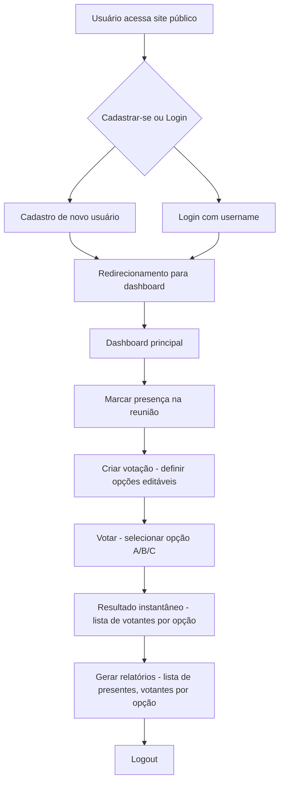
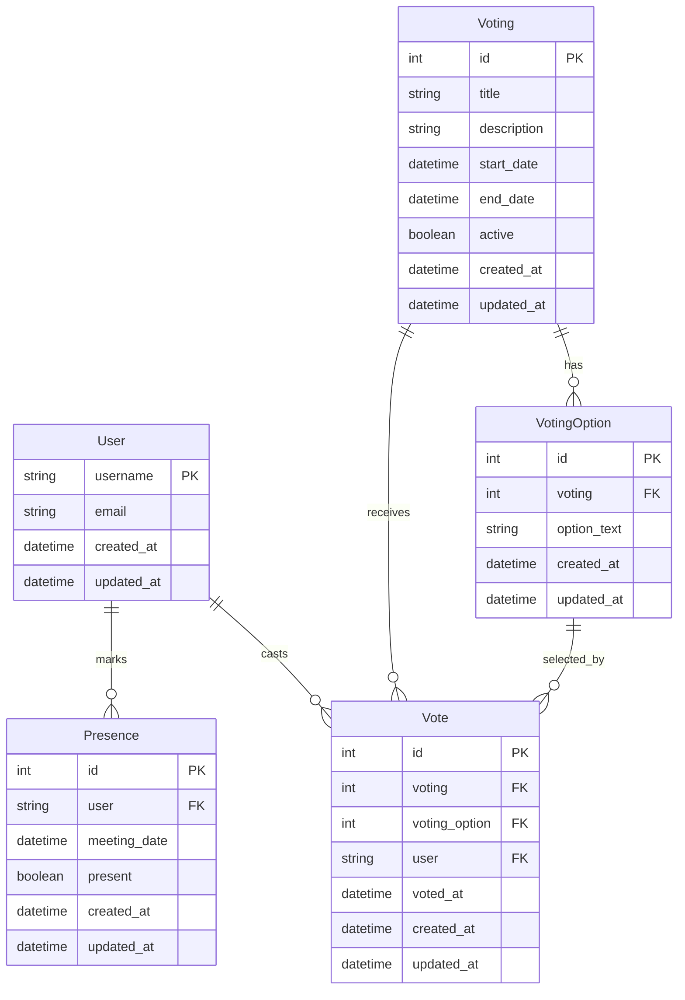

# Product Requirement Document (PRD) - Sistema de Votação Eletrônica

## 1. Visão Geral
O Sistema de Votação Eletrônica é uma aplicação web desenvolvida para o Conselho Deliberativo do Avai FC, permitindo votações seguras e eficientes em reuniões. O sistema utiliza Django full-stack com templates nativos e TailwindCSS para um design moderno e responsivo. A arquitetura é baseada em apps Django isolados para separação de responsabilidades, com autenticação nativa do Django via username.

## 2. Sobre o Produto
Sistema de votação eletrônico para reuniões do Conselho Deliberativo do Avai FC, desenvolvido em Python/Django com interface web responsiva. Inclui controle de presença, criação de votações, votação em tempo real e geração de relatórios.

## 3. Propósito
Facilitar votações democráticas e transparentes em reuniões do Conselho Deliberativo, garantindo que apenas membros presentes possam votar, com resultados instantâneos e relatórios detalhados.

## 4. Público Alvo
- Membros do Conselho Deliberativo do Avai FC
- Administradores do sistema (responsáveis por gerenciar votações)
- Participantes de reuniões que precisam votar via dispositivos móveis

## 5. Objetivos
- Possibilitar o controle dos presentes na reunião e somente os presentes poderão votar
- Possibilitar a criação da votação com as opções editáveis
- Possibilitar fácil acesso ao votante (exemplo: acesso via link no celular ao sistema de votação)
- Resultado instantâneo identificando o nome de cada votante na opção que foi votada gerando uma lista para a opção A, B, C
- Possibilidade de gerar relatórios da votação, lista de presentes e lista de votantes por opção de voto
- O sistema deve ser de fácil acesso, leve

## 6. Requisitos Funcionais

### Flowchart Mermaid com os Fluxos de UX

## 7. Requisitos Não-Funcionais
- **Performance**: Sistema leve, carregamento rápido (< 2s para páginas)
- **Usabilidade**: Interface intuitiva, acessível via mobile
- **Segurança**: Autenticação obrigatória, controle de presença
- **Confiabilidade**: Funcionamento 24/7 durante reuniões
- **Manutenibilidade**: Código seguindo PEP8, estrutura modular
- **Escalabilidade**: Suporte inicial para até 100 usuários simultâneos

## 8. Arquitetura Técnica

### Stack
- **Backend**: Python 3.x, Django 4.x
- **Frontend**: Django Template Language + TailwindCSS
- **Banco de Dados**: SQLite (padrão Django)
- **Autenticação**: Django Auth (username-based)
- **Servidor**: Django development server (produção a definir)

### Estrutura de Dados com Schemas em Formato Mermaid

## 9. Design System
- **Cores Primárias**: Azul escuro (#1e3a8a), Verde Avai (#22c55e), Branco (#ffffff)
- **Cores de Fundo**: Gradiente escuro (bg-gradient-to-br from-gray-900 to-gray-800)
- **Botões**: 
  - Primário: bg-blue-600 hover:bg-blue-700 text-white rounded-lg px-4 py-2
  - Secundário: bg-gray-600 hover:bg-gray-700 text-white rounded-lg px-4 py-2
- **Inputs**: border border-gray-300 rounded-lg px-3 py-2 focus:outline-none focus:ring-2 focus:ring-blue-500 bg-gray-800 text-white
- **Forms**: Espaçamento consistente com gap-4, labels em text-gray-300
- **Grids**: grid-cols-1 md:grid-cols-2 lg:grid-cols-3 gap-4
- **Menus**: bg-gray-800 text-white, hover:bg-gray-700
- **Fontes**: font-sans (Tailwind default), text-base para corpo, text-lg para títulos

## 10. User Stories

### Épico
Como membro do Conselho Deliberativo, quero um sistema completo de votação para garantir votações democráticas e transparentes em reuniões.

### Critérios de Aceite
- [ ] Usuário pode se cadastrar e fazer login
- [ ] Apenas usuários logados podem acessar o dashboard
- [ ] Administradores podem criar votações com opções editáveis
- [ ] Usuários podem marcar presença na reunião
- [ ] Apenas usuários presentes podem votar
- [ ] Votações mostram resultados em tempo real
- [ ] Sistema gera relatórios de presença e votos
- [ ] Interface responsiva funciona em mobile
- [ ] Design consistente em todas as telas

## 11. Métricas de Sucesso
- **KPIs de Produto**:
  - Tempo médio de carregamento < 2s
  - Taxa de erro < 1%
  - Uptime > 99.9%
- **KPIs de Usuário**:
  - Taxa de conclusão de votação > 95%
  - Tempo médio para votar < 30s
  - Satisfação do usuário > 4.5/5
- **KPIs de Negócio**:
  - Redução de tempo de reuniões em 20%
  - Aumento na participação de votações em 30%

## 12. Riscos e Mitigações
- **Risco**: Problemas de segurança na autenticação
  - **Mitigação**: Usar Django Auth nativo, implementar HTTPS
- **Risco**: Sobrecarga de usuários simultâneos
  - **Mitigação**: Otimizar queries, implementar cache
- **Risco**: Dados perdidos
  - **Mitigação**: Backups regulares, validação de dados
- **Risco**: Interface não responsiva
  - **Mitigação**: Testes em múltiplos dispositivos, usar TailwindCSS

## 13. Lista de Tarefas

### Sprint 1: Setup e Autenticação ✓
- [x] Configurar projeto Django
  - [x] Criar projeto com django-admin startproject
  - [x] Configurar settings.py com apps necessários
  - [x] Instalar TailwindCSS via CDN
  - [x] Criar requirements.txt com Django
- [x] Implementar autenticação
  - [x] Configurar Django Auth no settings.py
  - [x] Criar templates de login e cadastro
  - [x] Implementar views de login/logout
  - [x] Adicionar URLs para auth
- [x] Criar app accounts
  - [x] django-admin startapp accounts
  - [x] Configurar models.py (se necessário)
  - [x] Criar views.py com Class Based Views
  - [x] Configurar admin.py

### Sprint 2: Interface Base e Design System ✓
- [x] Criar templates base
  - [x] base.html com TailwindCSS
  - [x] navbar.html responsiva
  - [x] footer.html
  - [x] Definir cores e estilos globais
- [x] Página inicial pública
  - [x] Template index.html
  - [x] Links para cadastro e login
  - [x] Design responsivo com gradiente
- [x] Dashboard principal
  - [x] Template dashboard.html
  - [x] Menu lateral
  - [x] Cards para funcionalidades

### Sprint 3: Controle de Presença ✓
- [x] Criar app business
  - [x] django-admin startapp business
  - [x] Model Presence com campos necessários
  - [x] Admin configuration
- [x] Implementar marcação de presença
  - [x] View para marcar presença
  - [x] Template com botão de presença
  - [x] Validação de presença obrigatória
- [x] Listar presenças
  - [x] View para listar presentes
  - [x] Template com tabela responsiva

### Sprint 4: Sistema de Votações ✓
- [x] Modelos de votação
  - [x] Model Voting
  - [x] Model VotingOption
  - [x] Model Vote
  - [x] Configurar relacionamentos
- [x] Criar votação
  - [x] Form para criar votação
  - [x] Adicionar/remover opções dinamicamente
  - [x] Validação de dados
- [x] Interface de votação
  - [x] Template com opções A/B/C
  - [x] JavaScript para seleção (se necessário)
  - [x] Validação de presença antes de votar

### Sprint 5: Resultados e Relatórios ✓
- [x] Resultados em tempo real
  - [x] View para mostrar resultados
  - [x] Atualização automática (polling)
  - [x] Lista de votantes por opção
- [x] Relatórios
  - [x] Relatório de presença
  - [x] Relatório de votos por opção
  - [ ] Export para PDF/Excel (futuro)
- [x] Dashboard administrativo
  - [x] Visão geral das votações
  - [x] Estatísticas básicas

### Sprint 6: Otimização e Finalização ✓
- [x] Otimização de performance
  - [x] Otimizar queries com select_related
  - [x] Implementar cache básico
  - [ ] Comprimir assets (futuro)
- [x] Testes manuais
  - [x] Testar fluxo completo
  - [x] Testar responsividade
  - [x] Validar segurança básica
- [x] Documentação
  - [x] README.md
  - [x] Comentários no código (mínimos)