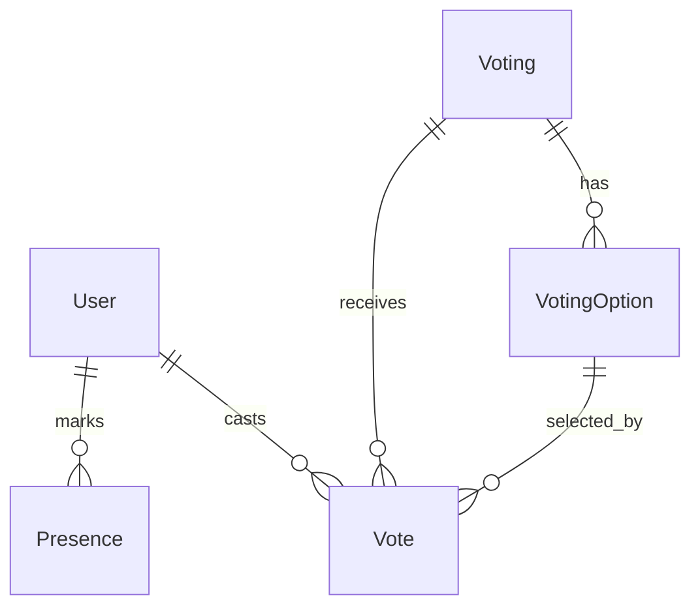

# Arquitetura do Projeto

## Stack Tecnológico

- **Backend**: Python 3.x + Django 4.x
- **Frontend**: Django Template Language + TailwindCSS
- **Banco de Dados**: SQLite (padrão Django)
- **Autenticação**: Django Auth (username-based)

## Estrutura de Diretórios

```
sistema_votacao/
├── accounts/          # App de autenticação e usuários
├── business/          # App de lógica de negócio (presença, votações)
├── core/              # Configurações do projeto Django
├── performance/       # App para métricas e performance
├── scouting/          # App para análises e relatórios
├── docs/              # Documentação do projeto
├── manage.py
└── requirements.txt
```

## Princípios Arquiteturais

### Separação por Apps
Cada domínio/entidade do sistema é isolado em um app Django específico:
- **accounts**: Gerenciamento de usuários
- **business**: Lógica de negócio (votações, presença)
- **performance**: Métricas e análises
- **scouting**: Relatórios e visualizações

### Autenticação
- Sistema nativo do Django (django.contrib.auth)
- Login via username (não email)
- Apenas usuários autenticados acessam o sistema interno

### Banco de Dados
- SQLite para desenvolvimento e produção inicial
- Todos os models devem ter campos `created_at` e `updated_at`

## Diagrama de Entidades



## Não Implementado (Sprints Futuras)
- Docker
- Testes automatizados
- Cache avançado
- Servidor de produção configurado
